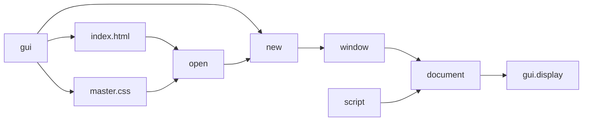

# document

`document` is the main API interface for the library, it contains most of the methods provided in the JavaScript [document object](https://developer.mozilla.org/en-US/docs/Web/API/Document)

## Open?(go)

The `Open` methed is used to load a file from disk and display the file.

## CreateElement?(go)

## parse?(go)

## extractStylesheets?(go)

## extractStyleTags?(go)

## localizePath?(go)

## encapsulateText?(go)

## matchFactory?(go)

## removeWhitespace?(go)

## removeHTMLComments?(go)

## check?(go)

<{./main.go}>
