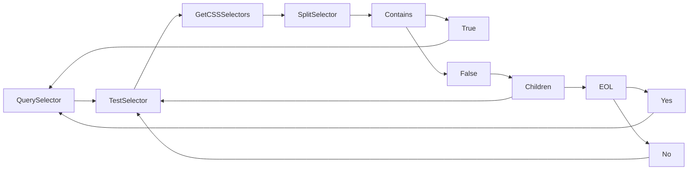
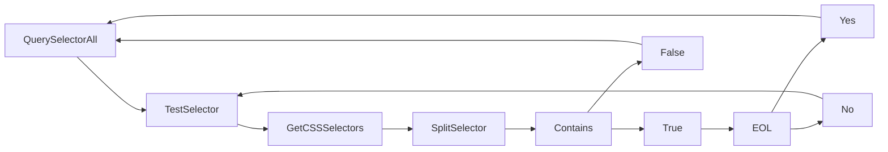

# Selector

Selector is a implementation of JavaScripts querySelector. It is split between two files this file and the `element` package to prevent circular dependancys, however this document will be the source for it. The best way to explain how this works is to start in the `element` package with the `querySelector` method and then take a look at the parts that make it up.





## QuerySelector?(go)

`QuerySelector` works almost the same as JavaScripts [querySelector method](https://developer.mozilla.org/en-US/docs/Web/CSS/CSS_selectors) with a far limited scope. After a document is loaded from a HTML file it is compiled into `element.Node`'s which is a custom implementation of `net/html.Node`. The reason the `net/html` node is not used is it has already defined features that stray away from JavaScripts DOM.

> if TestSelector(selectString, n) {return n}

To start out, we check the current element to see if the `selectString` matches the element.Node (n) we called the method on using the [`TestSelector`](./#testselectorgo) function. If it does we can end the function there and return itself. If it does not we can continue and check its children. We do this process recursively to simplify the code.

> if cr.Properties.Id != "" {return cr}

We also do a check to see if the `element.Node.Properties.Id` has been assigned. This is a importaint step as this id is the the `#id` used in html but a unqiue id generated at run time to be used as a internal reference. If it has not been assigned then the element does not exist.

## QuerySelectorAll?(go)

See [QuerySelector](./#queryselectorgo). `QuerySelectorAll` works the exact same as `QuerySelector` with an added collector (`results`) to collect all elements that match the selector throughout the recusive execution.

## TestSelector?(go)

`TestSelector` is the foundation of the [`QuerySelector`](./#queryselectorgo) and [`QuerySelectorAll`](./#queryselectorallgo) as seen above.

> parts := strings.Split(selectString, ">")

It first starts off by splitting the `selectString` in to parts divided by `>` this is becuase when you have a selector like `blockquote > p` you need to start at the first level (`p`) to compare the current node to see if you will need to continue to check the parents of the element with the next selector.

> selectors := []string{}
> if n.Properties.Focusable {
> if n.Properties.Focused {
> selectors = append(selectors, ":focus")
> }
> }
> classes := n.ClassList.Classes
> for \_, v := range classes {
> selectors = append(selectors, "."+v)
> }

Then we need to build the selectors, so we start by creating an array to store them in (`s`) and we check to see if the element is focusable and if the element is focused. If so we add the `:focus` selector to the list. This is important because when targeting a `:focus`ed element with a querySelector that is the text that is past. We then do the same for classes.

> if n.Id != "" {
> selectors = append(selectors, "#"+n.Id)
> }

Then we add the id to the array to complete the current Nodes selectors.

> part := selector.SplitSelector(strings.TrimSpace(parts[len(parts)-1]))
> has := selector.Contains(part, selectors)

After we have the current Nodes selectors we can use the [SplitSelector](./#splitselectorgo) and [Contains](./#containsgo) methods to process the passed query (selectString) and compare the two arrays.

> if len(parts) == 1 || !has {
> return has
> }

If we are on the last selector in the split selector (parts) or if we have a part that does not match (i.e. has == false) then we can go ahead and return the has value. We return this instead of just the constant `false` becuase if we have gotten to this point in the recursive chain that mean every part has been true until now, so the value of `has` weather `true` or `false` we detirmine if the selector matches for the entire selector string.

> } else {
> return TestSelector(strings.Join(parts[0:len(parts)-1], ">"), n.Parent)
> }

If we are not on the last element and the selector matches for this Node then we can remove the last element from `parts` as we have already checked to make sure it matches and join it be `>` charectors as that is what it was split by at the beginning. Then we just recall the function passing the parent as the Node.

## SplitSelector?(go)

`SplitSelector` works by simply spliting a CSS selector into it's individual parts see below for an example:

```go
func main() {
 fmt.Println(SplitSelector("p.text[name='first']"))
}
```

Result

```text
[p .text [name='first']]
```

## Contains?(go)

`Contains` compares two arrays of selectors, the first argument is the array of the selector that will be use to detirmine if the Node is a match or not. The second argument is the selecter of the targeted Node, the Node need to have all of the selectors of the `selector` array, however it can have additional selectors and it will still match.

<{./main.go}>

<{../element/main.go}>
